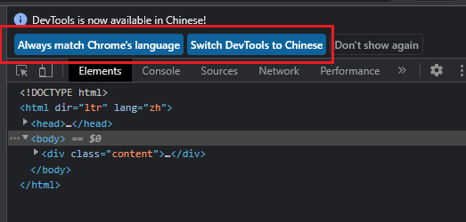
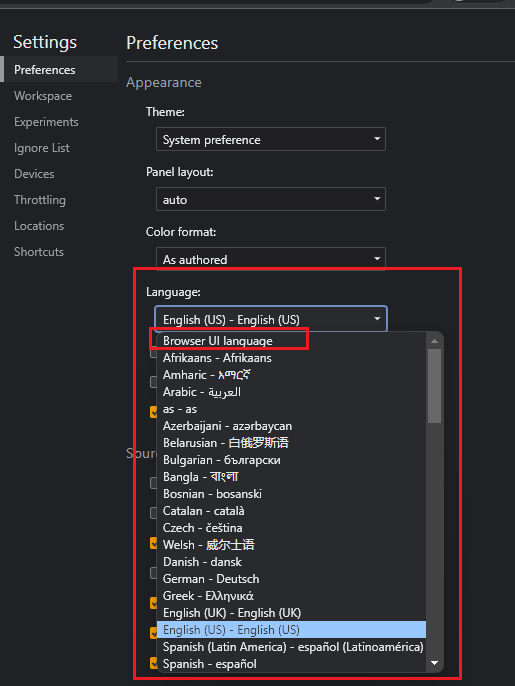
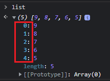
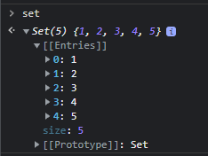
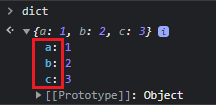
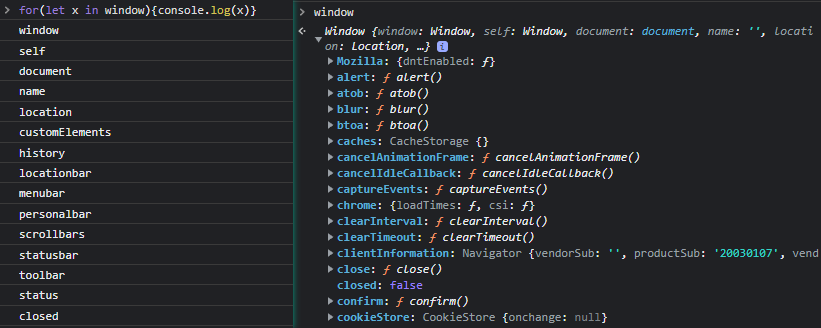
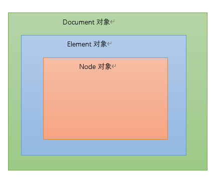

# P1 开发者工具的使用 与 JavaScript 基础教程

> [教程索引](../README.md) |
> [视频](#) |
> [前往我的博客查看](https://blog.chrxw.com/archives/2022/08/08/1678.html)

## 开发者工具的使用

> F12 或者 菜单 -> 更多工具 -> 开发者工具 调出

### 切换中文

> 更改语言后重新打开开发者工具生效



或者



### 界面简介

- 元素

  HTML 原文

  HTML节点的属性

- 控制台

  在任意Tab按ESC可以在下方调出

- 源代码

  浏览网站中的所有资源

  调试代码

- 网络

  抓包工具

- 应用

  查看本地储存的内容 Cookie Session LocalStorage

## JavaScript 基础教程

### 一些 JavaScript 学习资源

MDN 文档： <https://developer.mozilla.org/zh-CN/docs/Web/JavaScript>

廖雪峰： <https://www.liaoxuefeng.com/wiki/1022910821149312>

菜鸟教程： <https://www.runoob.com/js/js-tutorial.html>

uTools 插件

### 基本特性

- 单线程
- 弱类型 / 动态类型
- 大小写敏感
- `'` ,`"` 通用
- 不强制使用分号 (建议统一)
- 语法很灵活

运行时:
v8, NodeJS

### 基础语法

#### 注释

```javascript
//单行注释

/*
多行注释
*/
```

#### 变量与常量

赋值操作符 `var` `let` `const`

```javascript
//定义变量/常量
var a = 1;
var b;
let c = 1;
let d;
const e = 4;

//a,b,c,d,e 1 undefined 1 undefined 4
console.log("a,b,c,d,e",a,b,c,d,e);

//Uncaught SyntaxError: Missing initializer in const declaration
const f;

//赋新值
a = 2;
c = 3;
//Uncaught TypeError: Assignment to constant variable.
e = 1;

//重复定义
//undefined
var a = 6;
let c = 6;
//Uncaught SyntaxError: Identifier 'a' has already been declared
let a = 6;
//Uncaught SyntaxError: Identifier 'a' has already been declared
const a = 6;

//常量覆盖
const e = 6;
//e 6
console.log("e",e);

//在子域中覆盖(ES6引入)
var ts = 1;
let he = 2;
{
    var ts = "aaa";
    let he = "yyy";
    //ts,he aaa yyy
    console.log("ts,he",ts,he);
}
//ts,he aaa 2
console.log("ts,he",ts,he);
```

- var 定义一个 `变量`
- let 定义一个仅在作用域内生效的 `变量`
- const 定义一个 `常量`，一旦定义无法修改，但是可以覆盖定义


- 使用相同的操作符可以覆盖定义同名的变量，但是不建议这么使用
- 使用 `let` 覆盖定义时不影响父作用域的同名变量
- 强烈推荐优先使用 `let` 定义变量，如果值不需要改变，建议使用 `const` 定义成常量


- 函数提升

```javascript
//函数提升
foo(); // "bar"

function foo() {
  console.log("bar");
}

//这种写法的函数不会被提升
bar(); // 类型错误：bar 不是一个函数

var bar = function() {
  console.log("bar2");
};
```


#### 作用域

`{ }` 定义代码作用域 (ES6的内容)

使用 `let` 定义的变量，在子域可以访问父域的变量，但是父域不能访问子域的变量

函数中定义的内容外部无法访问

子域中定义的函数，父域无法访问

```javascript
//顶级作用域(最外层的作用域)
let x = 114;
{
  //子作用域
  let b = 514;
  //x,b 114 514
  console.log("x,b", x, b);
}

//函数内部其实也是一种作用域
function xbz() {
  let c = 233;
  //x,c 114 233
  console.log("x,c", x, c);
  //Uncaught ReferenceError: b is not defined
  console.log("b", b);
}
xbz();

//匿名函数同理
(() => {
  let d = 3.14;
  //x,d 114 3.14
  console.log("x,d", x, d);
  //Uncaught ReferenceError: b is not defined
  console.log("b", b);
})();
//另一种写法
(function() {
  let d = 3.14;
  //x,d 114 3.14
  console.log("x,d", x, d);
  //Uncaught ReferenceError: b is not defined
  console.log("b", b);
})();

//x 114
console.log("x", x);
//Uncaught ReferenceError: b is not defined
console.log("b", b);
//Uncaught ReferenceError: c is not defined
console.log("c", c);
//Uncaught ReferenceError: d is not defined
console.log("d", d);
```

一模一样的代码，只是使用 `var` 而不是 `let` ，可访问性略有区别

```javascript
//顶级作用域(最外层的作用域)
var x = 114;
{
  //子作用域
  var b = 514;
  //x,b 114 514
  console.log("x,b", x, b);
}

//函数内部其实也是一种作用域
function xbz() {
  var c = 233;
  //x,c 114 233
  console.log("x,c", x, c);
  //b 514
  console.log("b", b);
}
xbz();

//匿名函数同理
(() => {
  var d = 3.14;
  //x,d 114 3.14
  console.log("x,d", x, d);
  //b 514
  console.log("b", b);
})();

//x, 114
console.log("x", x);
//b, 514
console.log("b", b);
//Uncaught ReferenceError: c is not defined
console.log("c", c);
//Uncaught ReferenceError: d is not defined
console.log("d", d);
```

#### 数据类型

- 基础类型

  - 数值

    整数

    浮点数(小数)

    `NaN` (跟任何值比较都是false)

  - 字符串

    `" "`
    `'  '`
    ``` `  ` ``` (模板字符串，可以用 `${  }` 直接引用程序中的变量)

    ```javascript
    let a = 1;
    
    //'a=1'
    `a=${a}`
    ```

  - 布尔

    `true` `false`

- 对象 object

  - Array 数组

    `[ xxx, xxx ]`

    `new Array(xxx, xxx)`

    属性：

    - `length` 元素个数

    方法：

    - `at` 获取指定索引的元素，找不到返回 `underfined`，等效于 `Array[index]`

    - `contact` 拼接另一个可迭代元素，不影响原数组

    - `indexOf` 查找元素位置，索引从0开始，找不到返回-1

    - `includes` 是否包含元素，返回布尔

    - `join` 使用分隔符将列表元素合并成字符串

    - `push` 在末尾添加元素，返回数组长度
  
    - `pop` 移除末尾元素，返回被移除的元素

    - `unshift` 在数组首位添加元素，返回数组长度

    - `shift` 移除首位元素，返回被移除的元素

    - `slice` 切片，不影响原数组，返回切片后的新数组

      

    - `some` 传入lambda表达式，如果列表中含有符合表达式的元素，返回`true`，反之返回`false`

    - `filter` 传入lambda表达式，返回一个包含符合表达式的元素的新列表
    - `find` 传入lambda表达式，返回第一个符合表达式的元素，没有匹配则返回 `undefined`

    - `sort` 传入lambda表达式，返回排序后的数组

    - `forEach` 传入lambda表达式，将列表的每一个元素代入执行

  - 字典

    `{"key": value}`

    示例

    ```javascript
    let dict = {};
    //添加键值对
    dict["a"] = 1;
    dict.b = 2;
    
    //{a: 1, b: 2}
    console.log(dict);
    
    //一个字典中键名不会重复
    dict.b = 3;
    //{a: 1, b: 3}
    console.log(dict);
    
    //读取键值对, 不存在的键名返回 underfined
    //1
    console.log(dict.a);
    //3
    console.log(dict["b"]);
    //undefined
    console.log(dict["c"]);
    ```

    

  - Map 字典

    `new Map(); Map.set(key,value);`

    属性

    - `size` 键值对数量

    方法

    - `set` 添加键值对
    
    - `get` 通过键名获取键值, 不存在时返回 `underfined`
    
    - `clear` 清空字典
    
    - `has` 是否含有指定的键名
    
    - `delete` 删除指定键值对
    
    - `keys` 返回键名的可迭代对象
    
      
    
    - `forEach` 传入lambda表达式，将字典的每一个键名和键值一起代入执行	
    
  - Set 集合

    `new Set()`

    集合中元素是唯一的，可以用来去重，内部元素无序，无法通过索引访问

    属性

    - `size` 键值对数量

    方法

    - `add` 添加元素

    - `delete` 删除元素

    - `clear` 清空集合

    - `has` 是否有指定元素

    - `entries` 返回集合的可迭代对象

    - `keys` 返回集合的可迭代对象

      

    - `forEach` 传入lambda表达式，将集合中的每一个元素代入执行	

- 函数 function

>  获取变量类型 `typeof(xx)`

数据类型转换

```javascript
Boolean(any) //任意类型转布尔
String() //所有类型都可以用这个转成字符串
Number() //任意类型转数值类型，转换失败返回NaN 

parseFloat(any) //转换失败返回NaN 
parseInt(any) //转换失败返回NaN
object.toString() //基础类型没有这个方法
```

变量比较的坑 `==` 与 `===` ( `=` 是赋值操作符)

- `==` 比较操作符，自动隐式类型转换
- `===` 绝对等于，不允许自动类型转换

- `NaN` 跟任意值比较结果都是 `false`

- 推荐优先使用 `===` 判断是否相等

- 一些被认为是 `false` 的值
  - `false`
  - `underfined`
  - `null`
  - `0`
  - `NaN`
  - `""`

#### 执行流

- if 条件判断

  ```javascript
  if( /* 表达式 */ )
  {
  	//表达式运算结果转换为布尔为 true 时执行该块
  }
  else if( /* 表达式2 */ ) //也可以使用 else if 连续判断多个表达式
  {
      //可以存在任意和 else if 子句，也可以省略
      //表达式2运算结果转换为布尔为 true 时执行该块
  }
  else 
  {
      //else 子句可以省略
      //表达式1和表达式2的运算结果转换为布尔都为 false 时执行该块
  }
  
  //示例
  let a = 500;
  if(a > 514){
      console.log(1);
  }
  else if(a < 114){
      console.log(2);
  }
  else{
      console.log("啊啊啊");
  }
  //"啊啊啊"
  ```

- switch 分支

  ```javascript
  switch ( /* 表达式 */ ) {
     case /* 值1 */:
        //表达式计算结果等于值1时执行从case到第一个break之间的语句
        [break;]//不写break的话会case语句
     case /* 值2 */:
        //表达式计算结果等于值2时执行从case到第一个break之间的语句
        [break;]
     //可以存在任意个case
     default: //只能写在最后, 可以省略
        //当表达式的值不满足任意一个case, 或者没有遇到break跳出时执行这里的语句
        [break;]//可以写break,但是没有必要
  }
  
  //示例
  for(let x=0; x<5; x++)
  {
      switch (x){
          case 1:
              console.log('1');
          case 2:
          case 4:
              console.log('2 or 4');
              break;
          default:
              console.log('default'); 
  	}
  }
  /*
  default
  1
  2 or 4
  2 or 4
  default
  2 or 4
  */
  ```

- for 循环

  - for

    最通用的计数循环

    ```javascript
    for(/* 初值设定，只执行一次 */ ; /* 表达式，满足条件则执行循环 */ ; /* 每次循环后执行 */){
        //循环执行这里的语句
    }
    
    //例子
    for (let i = 0; i < 5; i++) {
      console.log(i);
    }
    //0 1 2 3 4
    
    const list = [1,2,3,4,5];
    for (let i=0; i < list.length; i++){
        console.log(list[i]);
    }
    //1 2 3 4 5
    ```

  - for...in

    自动枚举对象的 `可枚举属性` ，适用于枚举 `字典` ，一般不适用于 `数组` 和 `集合`

    不能在循环体内修改迭代对象

    ```javascript
    //错误示范
    const list = [9,8,7,6,5];
    for(let x in list){
        console.log(x);
    }
    //0 1 2 3 4
    //获取的实际上是元素的下标
    const set = new Set([1,2,3,4,5]);
    for(let x in set){
        console.log(x);
    }
    //无输出
    //为什么会得到这样的结果？
    ```

    

    ```javascript
    //对字典使用则会得到预期的结果
    const dict = {'a':1,'b':2,'c':3};
    
    for(let x in dict){
        console.log(x);
    }
    //a b c
    ```

    

    for...in 循环还可以用来迭代 `对象` 的 `属性`

    

  - for...of 循环

    自动枚举可迭代对象的每一个元素 ，适用于任何可迭代对象，`字典` 不可直接迭代

    不能在循环体内修改迭代对象

    ```javascript
    const list = [9,8,7,6,5];
    for(let x of list){
        console.log(x);
    }
    //9 8 7 6 5
    const set = new Set([1,2,3,4,5]);
    for(let x of set){
        console.log(x);
    }
    //1 2 3 4 5
    
    //错误示例
    const dict = {'a':1,'b':2,'c':3};
    
    for(let x of dict){
        console.log(x);
    }
    //TypeError: dict is not iterable
    ```

  - forEach 循环

    严格意义上来说是属于部分可迭代对象的原型方法 ( `Prototype` )，而不是通用操作符

    需要传入一个函数，执行过程就是把可迭代对象的每个元素代入函数中执行，因为每次循环都相当于调用函数，因此效率远不如上面的几种 for 循环

    ```javascript
    const list = ['a', 'b', 'c'];
    
    list.forEach(x => console.log(x));
    //a b c
    
    //相当于
    list.forEach(function(x) {
       console.log(x);
    });
    ```

    > 执行速度 for > for...in / for...of >>> forEach

- while 循环

  - while

    类似 `for` 循环，满足循环条件就会一直执行循环体

    ```javascript
    while(/* 循环条件为 true 则进入循环 */)
    {
        /* 循环执行体 */
    }
    
    //例子
    let x = 3;
    while(x--){
        console.log(x);
    }
    //2 1 0
    
    //要注意避免出现死循环
    ```

  - do...while

    在执行循环体后才会检查循环条件，也就是说至少会执行一次循环体

    ```javascript
    do {
        /* 循环执行体 */
    } while(/* 循环条件为 true 则进入循环 */)
    
    //例子
    let x = 3;
    do {
        console.log(x);
    } while(x--);
    //3 2 1 0
    ```

- 循环操作

  - continue

    跳过执行当前循环体，进行下一轮循环

    ```javascript
    //跳过执行部分循环
    let x = 0;
    while(x++ < 10)
    {
        if(x % 3 == 0){
            continue;
        }
        console.log(x);
    }
    //1 2 4 5 7 8 10
    
    //使用 label 自由控制外部循环
    var i = 0;
    var j = 10;
    checkiandj:
      while (i < 4) {
        console.log('i',i);
        i += 1;
        checkj:
          while (j > 4) {
            console.log('j',j);
            j -= 1;
            if ((j % 2) == 0) {
              continue checkj;
            }
            console.log(j + ' 是奇数。');
          }
          console.log('i = ' + i);
          console.log('j = ' + j);
      }
    ```

  - break

    结束当前循环体

    ```javascript
    //结束循环
    const a = [1,2,3,4,5];
    for (i = 0; i < a.length; i++) {
        if (a[i] == 3) {
            break;
        }
        console.log(a[i]);
    }
    //1 2
    
    //也可以指定 label 终止外部循环
    let x = 0;
    let z = 0
    labelCancelLoops:
    while (true) {
      console.log("外部循环: " + x);
      x += 1;
      z = 1;
      while (true) {
        console.log("内部循环: " + z);
        z += 1;
        if (z === 3 && x === 3) {
          break labelCancelLoops;
        } else if (z === 3) {
          break;
        }
      }
    }
    ```

- try-catch 错误捕获

  在 try 块中的代码如果执行遇到错误，会被 catch 块捕获，而不会影响外部代码继续执行

  ```javascript
  try {
      //使用 throw 可以手动引发异常
      throw '114514异常';
  } catch (error) {
      console.error(error);
  }
  //控制台输出了异常消息
  
  //还可以使用 finally 块，不论是否遇到错误，跳出 try...catch 块前都会执行 finally 块的代码
  try {
      //使用 throw 可以手动引发异常
      throw '114514异常';
  } finally {
      console.log('finally')
  }
  
  //finally 和 catch 块都是可选的，也可以一起用，但是不能单独使用 try 块
  try {
      //使用 throw 可以手动引发异常
      throw '114514异常';
  } catch (error) {
      console.error(error);
  } finally {
      console.log('finally')
  }
  ```

#### 运算操作符

- 算数运算

  摆烂了，看MDN吧： https://developer.mozilla.org/zh-CN/docs/Web/JavaScript/Guide/Expressions_and_Operators

  - `+` 加
  - `++` 自增
  - `-` 减
  - `--` 自减
  - `*` 乘
  - `/` 除
  - `**` 指数
  -  `%` 取余数

- 位运算

  - `&` 按位与
  - `|` 按位或
  - `^` 按位异或

- 逻辑运算

  - `&&` 逻辑与 
  - `||` 逻辑或


- 简化赋值运算
  - `x += y` => `x = x + y`
  - `x -= y` => `x = x - y`
  - `x *= y` => `x = x * y`
  - `x /= y` => `x = x / y`
  - `x %= y` => `x = x % y`
  - `x **= y` => `x = x ** y`
  - `x <<= y` => `x = x << y`
  - `x >>= y` => `x = x >> y`
  - `x &= y` => `x = x & y`
  - `x |= y` => `x = x | y`
  - `x ^= y` => `x = x ^ y`
  
- 解构赋值

  ```javascript
  //可迭代元素的解构，相当于把不同下标的元素赋值给定义的变量
  const list = ['1','2','3'];
  let [t1, t2, t3, t4] = list;
  console.log(t1,t2,t3,t4);
  //1 2 3 undefined
  //如果元素不够分配，未分配到的元素不会被赋值
  
  //使用 ... 可以让某个变量接受剩余元素
  const list = ['1','2','3','4','5'];
  let [t1, t2, ...t3] = list;
  console.log(t1,t2,t3);
  //1 2 (3) ['3', '4', '5']
  //注意，t3变量是一个数组
  
  //也可以对字典使用解构，但是需要使用 {} 而不是 []
  const dict = {aa:1,bb:2,cc:3};
  let {bb,aa,cc,dd} = dict;
  console.log(aa,bb,cc,dd);
  //1 2 3 undefined
  //字典的解构赋值是通过 key 而不是变量索引来获取的，因此变量的顺序无关紧要
  
  //如果变量和key名字不一致也可以指定别名
  const dict = {aa:1,bb:2,cc:3};
  let {aa:s1,bb:s2,cc:s3} = dict;
  console.log(s1,s2,s3);
  //1 2 3
  ```

- 三目运算

  `表达式 ? 值1 : 值2`

  当表达式成立，三目运算的结果为值1，当表达式不成立，三目运算的结果为值2

  ```javascript
  let x = false ? 1 : 2;
  console.log(x);
  //2
  
  let x = true ? 1 : 2;
  console.log(x);
  //1
  ```

#### 浏览器对象 Window

window 是浏览器对象，访问属性或者方法的时候可以省略 `window`

常用属性

- `document` HTML文档对象，页面上的元素都可以通过这个对象获取
- `console` 控制台对象，用于打印日志
- `location` 地址对象，读取网页链接或者控制跳转
- `localStorage` 访问本地储存数据
- `screen` 获取显示器分辨率
- `scrollX` , `scrollY` 水平/垂直滚动条位置

常用方法

- `alert` 弹出提示框，会阻塞 JS 运行
- `confirm` 弹出确认提示框，会阻塞 JS 运行
- `blur` 将焦点移出当前窗口
- `close` 关闭窗口
- `eval` 执行字符串形式的 JS 语句
- `find` 查找指定字符串，并聚焦到字符串的位置
- `focus` 激活当前窗口
- `open` 打开新窗口 (标签页)
- `openDialog` 打开新的对话框窗口
- `print` 显示打印对话框
- `prompt` 弹出输入框，会阻塞 JS 运行
- `scroll` 控制滚动条滚动到指定位置
- `stop` 停止加载

#### 文档对象 Document

Document 接口是 HTML 页面的另一种形式，或者叫 DOM 树，通过 `window.document` 可以获取当前窗口的 DOM 树，通过 Document 对象可以很方便的添加或者修改 DOM 元素

Document 对象也继承了 Node 对象的属性和方法

常用属性

- `body` 返回 `<body>` 节点
- `head` 返回 `<head>` 节点
- `cookie` 读取或者设置 cookie
- `title` 获取或者设置网页标题
- `URL` 返回地址栏链接

常用方法

- `createElement` 指定标签名，创建一个新的元素
- `getElementsByClassName` 指定类名查找元素
- `getElementById` 指定ID查找元素
- `querySelector` 通过CSS选择器查找第一个匹配元素
- `querySelectorAll` 通过CSS选择器查找所有匹配元素
- `evaluate` 执行XPath表达式
- `hasFocus` 返回当前文档是否拥有焦点

#### 文档元素对象 Element

Element 对象相当于HTML中的Tag，比如 `<div></div>`

Element 对象也继承了 Node 对象的属性和方法

常用属性

- `attributes` 标签属性集合
- `classList` 标签 class 属性列表 (按空格分隔)
- `className` 标签 class 属性的值
- `id` 标签的 id 属性
- `innerHTML` DOM 元素内部的 HTML 文本
- `innerText` DOM 元素内部的文本
- `tagName` 标签自身的名称，例如 `div` `a` `span` 等

常用方法

- `addEventListener` 添加事件监听器，需要指定事件名和回调函数，触发特定事件后自动调用回调函数
- `dispatchEvent` 手动触发指定的事件
- `getAttribute` 获取标签的指定属性

#### 文档节点对象 Node

网页中的所有 Node 一起构成了 DOM 树，对节点的修改会反应到网页中

常用属性

- `childNodes` 返回该节点的所有子节点
- `firstChild` 返回第一个子节点，没有返回 `null`
- `lastChild` 返回最后一个子节点，没有返回 `null`
- `nodeName` 返回节点对应的名称，比如 `#document`
- `nodeType` 返回节点类型对应的值，具体定义参考 MDN
- `parentNode` 返回父节点
- `parentElement` 返回父元素
- `textContent` 返回节点内所有子节点的文本内容

常用方法

- `appendChild` 将指定节点作为子节点添加到当前节点的末尾
- `cloneNode` 克隆指定节点
- `hasChildNodes` 判断当前节点是否有子节点
- `insertBefore` 在当前节点新增子节点，插入在指定节点之前

#### Document Element 与 Node



- `Document` 即 DOM 树，包含了网页中的所有 DOM 对象，既包含 `Element` 也包含 `Node`
- `Element` 标签元素，类似与 `<a href="xx">xxx</a>`，它继承 `Node` 的属性和方法，同时具有自己特有的属性和方法
- `Node` 节点，是 DOM 树的最基础单位，比如 `<a href="xx">xxx</a>` 这一个 `Element`，就包含一个 `A` Node （即 `<a href="xx"></a>`）和一个 `Text` Node（即 `xxx`）

> 一个 Element 可以包含任意个 Element 元素 和 Node 元素
