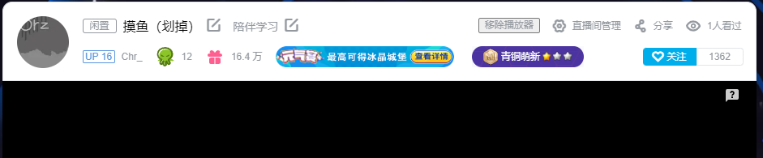
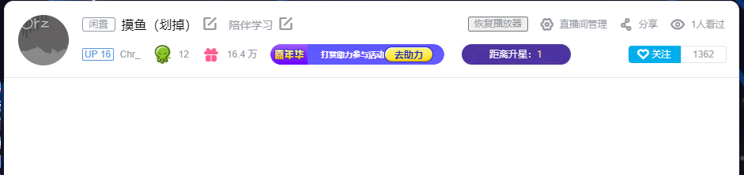

# P2 初识油猴脚本

光讲JS感觉不是特别直观，用两个不涉及网络请求的脚本进行讲解

## 第一个脚本 - Remove Live.js

脚本链接： https://github.com/chr233/GM_Scripts/blob/master/Bilibili/Remove_Live.js

脚本功能： 提供一个开关，用于移除直播播放器，并且带有记忆功能

源码：

```javascript
// ==UserScript==
// @name         Remove_Live
// @name:zh-CN   去除B站直播间播放器
// @namespace    https://blog.chrxw.com
// @version      1.1
// @description  去除B站多余的直播播放器（滑稽）
// @author       Chr_
// @include      https://live.bilibili.com/*
// @license      AGPL-3.0
// @icon         https://blog.chrxw.com/favicon.ico
// ==/UserScript==

(() => {
    "use strict";
    //去除播放器的开关
    let VEnable = localStorage.getItem("VEnable") === "true";
    if (VEnable) {
        setTimeout(() => {
            document.getElementById("live-player").remove();
        }, 3000);
    }
    let btnArea = document.querySelector(".right-ctnr");
    let btn = document.createElement("button");
    btn.textContent = VEnable ? "恢复播放器" : "移除播放器";
    btn.addEventListener("click", () => {
        VEnable = !VEnable;
        localStorage.setItem("VEnable", VEnable);
        btn.textContent = VEnable ? "恢复播放器" : "移除播放器";
        if (VEnable) {
            document.getElementById("live-player").remove();
        } else {
            location.reload();
        }
    });
    btnArea.insertBefore(btn, btnArea.children[0]);
})();
```





## 第二个脚本 - SteamDB CN.js

脚本链接： https://github.com/chr233/GM_Scripts/blob/master/SteamDB/SteamDB_CN.js

脚本功能： 汉化SteamDB

源码：

```javascript
// ==UserScript==
// @name:zh-CN          SteamDB汉化
// @name                SteamDB_CN
// @namespace           https://blog.chrxw.com
// @supportURL          https://blog.chrxw.com/scripts.html
// @contributionURL     https://afdian.net/@chr233
// @version             1.32
// @description         SteamDB汉化插件
// @description:zh-cn   SteamDB汉化插件
// @author              Chr_
// @match               https://steamdb.info/*
// @license             AGPL-3.0
// @icon                https://blog.chrxw.com/favicon.ico
// @resource            data https://cf.chrxw.com/SteamDB/SteamDB_CN.json
// @grant               GM_addStyle
// @grant               GM_getResourceText
// @grant               GM_registerMenuCommand
// ==/UserScript==


(() => {
  "use strict";
  //是否打开调试模式（使用自定义汉化规则而不是在线规则）
  const DEBUG = localStorage["dbg_mode"] == "开";
  //是否在控制台输出未汉化文本
  const OUTPUT = localStorage["out_word"] == "开";

  GM_registerMenuCommand(`调试汉化文本: 【${DEBUG ? "开" : "关"}】`, () => {
    window.localStorage["dbg_mode"] = DEBUG ? "关" : "开";
    window.location.reload();
  });

  GM_registerMenuCommand(`在控制台输出未匹配文本: 【${OUTPUT ? "开" : "关"}】`, () => {
    window.localStorage["out_word"] = OUTPUT ? "关" : "开";
    window.location.reload();
  });

  document.querySelector("html").setAttribute("lang", "zh-CN");

  let Locales;

  if (DEBUG) {
    const template = `{"DOC":{"更新时间":"调试模式","贡献名单":["调试模式"]},\n"STATIC":\n{\n\n},\n"INPUT":\n{\n\n},\n"LABEL":\n{\n\n},\n"DYNAMIC":\n{\n\n}\n}`;
    const box = document.createElement("div");
    box.className = "sdc";
    const text = document.createElement("textarea");
    box.appendChild(text);
    const action = document.createElement("div");
    action.className = "sdc-links";
    box.appendChild(action);
    const btnSave = document.createElement("a");
    btnSave.innerText = "💾 保存并应用";
    btnSave.addEventListener("click", () => {
      const raw = text.value.trim();
      if (!raw) {
        alert("翻译文本不能为空!!!");
      } else {
        try {
          JSON.parse(raw);
          window.localStorage["sdb_lang"] = raw;
          window.location.reload();
        } catch (e) {
          alert("翻译文本不是有效的JSON格式!!!");
        }
      }
    });
    action.appendChild(btnSave);
    const btnReset = document.createElement("a");
    btnReset.textContent = "🗑️ 清空文本";
    btnReset.addEventListener("click", () => {
      window.localStorage["sdb_lang"] = template;
      window.location.reload();
    });
    action.appendChild(btnReset);
    const btnOnline = document.createElement("a");
    btnOnline.textContent = "📄 当前在线文本";
    btnOnline.addEventListener("click", () => {
      if (confirm("替换为在线版本后当前所做修改将会丢失, 确定要继续吗?")) {
        text.value = GM_getResourceText("data");
      }
    });
    action.appendChild(btnOnline);
    const about = document.createElement('a');
    about.href = "https://blog.chrxw.com"
    about.innerText = "🔗 By Chr_ © 2022";
    action.appendChild(about);

    const father = document.getElementById("main");
    father.insertBefore(box, father.firstChild);
    const customLang = window.localStorage["sdb_lang"] ?? template;
    text.value = customLang;
    Locales = JSON.parse(customLang);
  } else {
    Locales = JSON.parse(GM_getResourceText("data"));
  }

  //计时
  const Start = new Date().getTime();

  {//静态元素
    for (const [css, dic] of Object.entries(Locales.STATIC)) {
      if (OUTPUT) { console.log(`〖${css}〗`); }
      const elements = document.querySelectorAll(css);
      if (elements.length > 0) {
        for (let i = 0; i < elements.length; i++) {
          const element = elements[i];
          if (element.childElementCount === 0) {//节点内部无其他元素
            const raw = element.innerText?.trim();
            if (!raw || raw.length <= 2) { continue; }
            const txt = dic[raw];
            if (txt) {
              element.innerText = txt;
            } else if (OUTPUT) {
              console.log(`"${raw}": "",`);
            }
          } else {//节点内部有其他元素
            const nodes = element.childNodes;
            for (let j = 0; j < nodes.length; j++) {
              const node = nodes[j];
              if (node.nodeType === Node.TEXT_NODE) {
                const raw = node.textContent?.trim();
                if (!raw || raw.length <= 2) { continue; }
                const txt = dic[raw];
                if (txt) {
                  node.textContent = txt;
                } else if (OUTPUT) {
                  console.log(`"${raw}": "",`);
                }
              }
            }
          }
        }
      } else {
        if (OUTPUT) { console.warn(`CSS选择器未匹配到任何元素: ${css}`); }
      }
    }
  }

  {//输入框
    const inputs = Locales.INPUT;
    if (OUTPUT) { console.log("〖输入框〗"); }
    const elements = document.querySelectorAll("input");
    for (let i = 0; i < elements.length; i++) {
      const element = elements[i];
      const raw = element.placeholder;
      if (!raw) { continue; }
      const txt = inputs[raw];
      if (txt) {
        element.placeholder = txt;
      } else if (OUTPUT) {
        console.log(`"${raw}": "",`);
      }
    }
  }

  {//悬浮提示
    const labels = Locales.LABEL;
    if (OUTPUT) { console.log("〖提示文本〗"); }
    const elements = document.querySelectorAll("*[aria-label]");
    for (let i = 0; i < elements.length; i++) {
      const element = elements[i];
      const raw = element.getAttribute("aria-label");
      if (!raw) { continue; }
      const txt = labels[raw];
      if (txt) {
        element.setAttribute("aria-label", txt);
      } else if (OUTPUT) {
        console.log(`"${raw}": "",`);
      }
    }
  }

  const { script: { version } } = GM_info;
  //const version = GM_info.script.version;
  const { DOC: { "更新时间": update, "贡献名单": contribution } } = Locales;

  const End = new Date().getTime();

  // 统计耗时
  console.log("执行耗时", `${End - Start} ms`);
  console.log("=================================");
  console.log(`插件版本: ${version}`);
  console.log(`更新时间: ${update}`);
  console.log(`贡献名单: ${contribution.join(", ")}`);
  console.log("=================================");
  console.log("迷茫同学:\n『没有恶意 请问直接用谷歌翻译整个网页不香吗』")

  // 添加按钮
  const headerUl=document.querySelector(".header-menu-container>div>ul:nth-child(1)");
  const footerUl=document.querySelector(".footer-container>div>ul:nth-child(1)");
  const scriptLink = document.createElement("li");
  scriptLink.innerHTML = `<a href="https://blog.chrxw.com" target="_blank">SteamDB 汉化 V${version}</a>`;
  headerUl.appendChild(scriptLink);
  footerUl.appendChild(scriptLink.cloneNode(true));

  // 添加样式
  GM_addStyle(`
  .tabnav-tabs > a {
    min-width: 80px;
  }
  .sdc {
    display: flex;
  }
  .sdc > textarea {
    width: 100%;
    height: 200px;
    min-height: 200px;
    resize: vertical;
  }
  .sdc > div.sdc-links {
    width: 150px;
    margin: 5px;
  }
  .sdc > div.sdc-links > a {
    width: 100%;
    margin-bottom: 10px;
    background-color: #213145;
    color: white;
    font-size: 12px;
    border-radius: 0px;
    display: inline-block;
    height: 30px;
  }
  .sdc > div.sdc-links > a:last-child {
    width: 100%;
    margin-top: 30px;
    margin-bottom: 0px;
    color: #67c1f5;
    background-color: #273b4b;
  }
`);
})(); 
```

## 油猴脚本基本构成

### 元信息

记录脚本的额外信息，供油猴插件以及 GreasyFork 使用

```javascript
// ==UserScript==
// @name:zh-CN          脚本名称(可选，可以使用语言代码来支持多语言)
// @name                脚本名称
// @namespace           命名空间
// @version             脚本版本
// @description         脚本描述
// @description:zh-cn   脚本描述(可选，可以使用语言代码来支持多语言)
// @author              作者
// @include             脚本生效域名
// @match               脚本生效域名
// @license             共享协议
// @icon                脚本图标(可选)
// @resource            外部资源链接，以及访问名称(可选)
// @grant               申请额外权限(可选)
// ==/UserScript==
```

### 脚本正文

略
