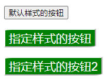
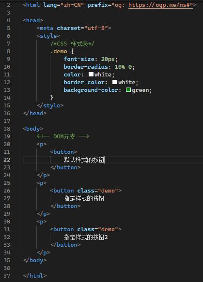

# P3 元素, CSS 与 CSS选择器

CSS 即 Cascading Style Sheets (层叠样式表) 的缩写, 用于给元素 (Element) 附加额外的样式, 简单来说就是告诉浏览器每个元素渲染出来是什么样子

DOM 树描述了网页的内容, 而 CSS 描述了其中每个元素 (Element) 的外观

既然叫 `层叠样式表` , 也就是说同一个元素可以同时具有很多样式, 浏览器会自动套用优先级最高的样式

示例如下

示例中的 HTML 文件中分为两块, `head` 中的 `style` 节定义了 CSS , `body` 节定义了网页中的所有静态元素

当然更常见的情况是把CSS样式表拿出来保存成 `css` 文件，然后在 `html` 中引用该文件，通过 `class` 属性联系起来，可以很方便地让相似的元素共用一套样式，也更方便维护代码

这种规则就是 CSS选择器, 一方面可以用来定义样式作用在哪些元素上, 另一方面, 也可以用来获取特定的元素

